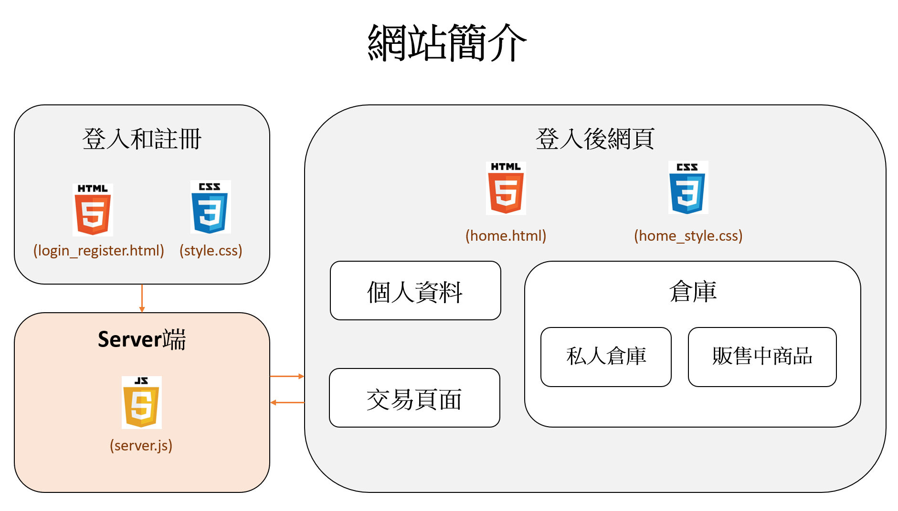
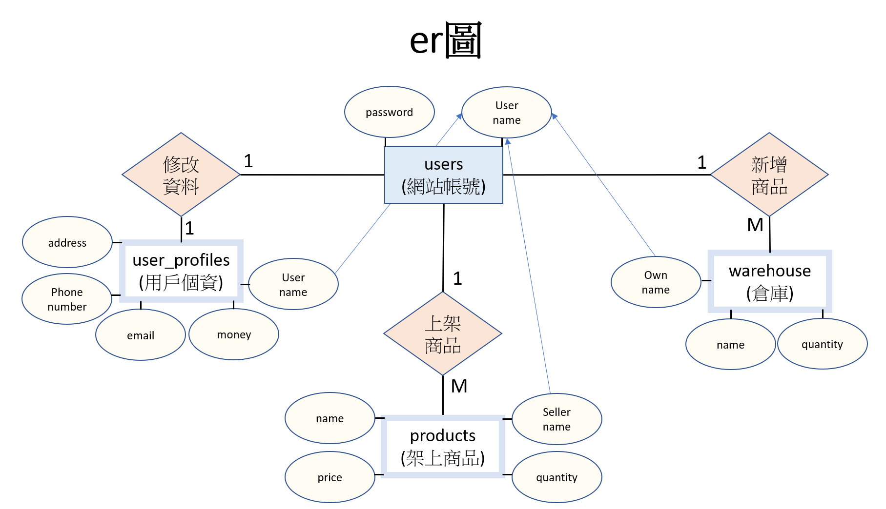
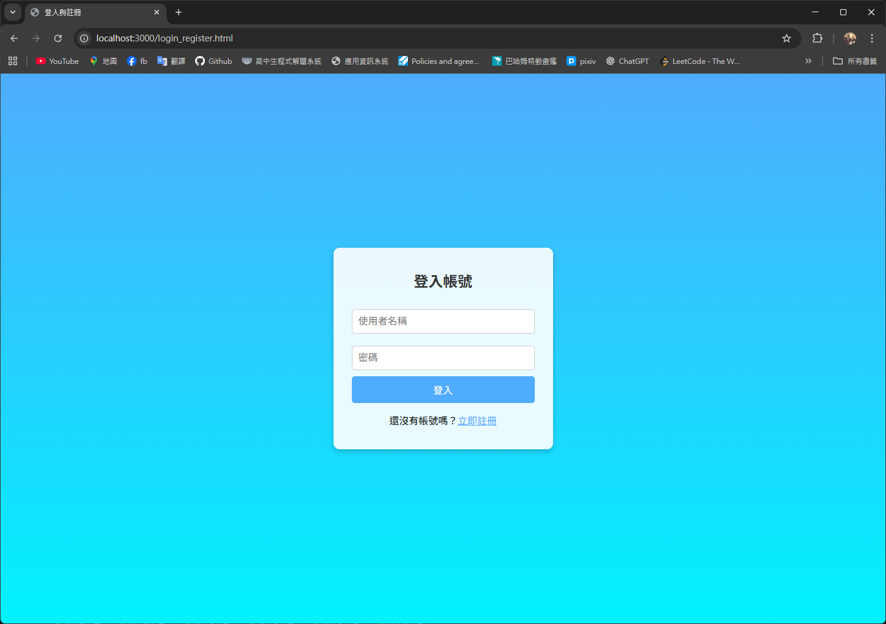
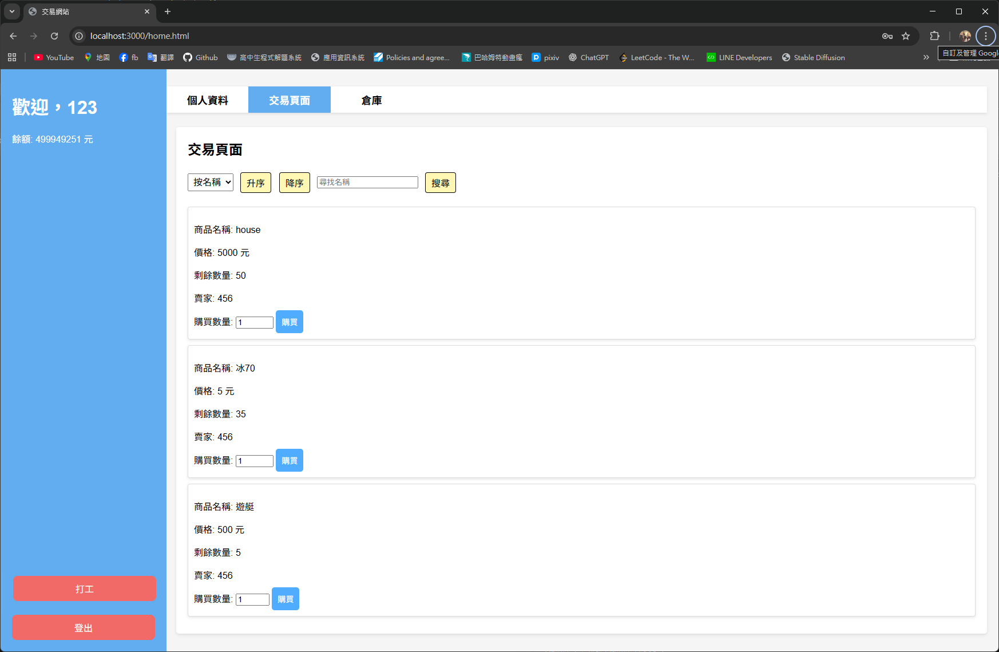

# Database System – 期末專案

## 專案簡介
本專案為「資料庫系統」課程的期末專題，內容涵蓋 **使用 Node.js 建立後端伺服器**，
並搭配 MySQL 資料庫進行使用者登入、註冊與交易等基本介面操作。

|  |  |
|:--:|:--:|
| 圖一、網站架構圖 | 圖二、資料庫Er圖 |

|  |  |
|:--:|:--:|
| 圖三、登錄/註冊介面 | 圖四、交易/倉庫介面 |

## 檔案說明
- `server.js`：Node.js 後端伺服器程式  
- `com.sql`：SQL 腳本，包含資料表建立與測試資料  
- `public/`：前端靜態檔案
  - `home.html` / `home_style.css`：首頁頁面與樣式
  - `login_register.html` / `style.css`：登入、註冊頁面與樣式
- `資料庫系統_期末報告.pptx`：期末簡報檔  
- `node_modules.zip`：依賴模組壓縮檔（需解壓縮後使用）  
- `package-lock.json`：NPM 依賴管理檔  

## 執行方式
1. 解壓縮模組壓縮檔
```bash
unzip node_modules.zip -d node_modules
```
2. 以資料庫管理工具開啟`com.sql`(本專案使用MySQL)
3. 啟動伺服器
```bash
node server.js
```
3. 伺服器啟動後，可在瀏覽器訪問 http://localhost:3000 查看網站  
4. 網站可供登陸、註冊、修改個資、上下架商品、購買與排序功能

## 專案特色
- 使用 Node.js + Express 建立後端
- 前後端分離：HTML/CSS 前端與 Node.js 後端結合
- 使用"佔位符"防資料庫注入攻擊
- MySQL 資料庫進行使用者資料管理