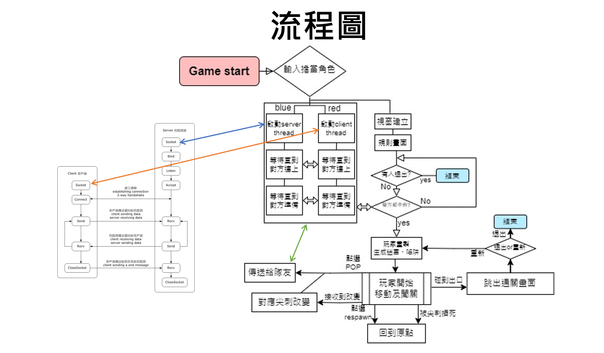
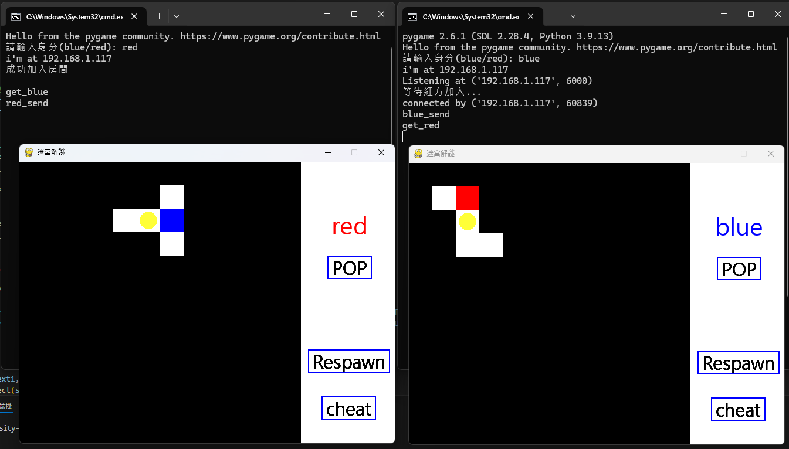

# Internet Application Design – 期末專題

## 專案簡介
本專案為「網際網路應用設計」課程期末專題，主題與 **TCP/IP 網路應用程式設計** 有關。



## 檔案說明
- `test.py`：程式實作，包括 TCP/IP 通訊與遊戲主體  
- `tcp-ip期末專題.pptx`：期末簡報檔  
- `font.ttf`：專案使用的字型檔  

## 執行方式
1. 下載好必要的函式庫後執行
```bash
python test.py
```
2. 需具備兩名玩家(red/blue)並輸入對應角色  
3. 進入遊戲後透過互相開關尖刺並設法雙人通關

## 專案特色
- 練習使用 Python socket 程式設計
- 結合 pygame 實現可控性高的小遊戲介面
- 展示 TCP/IP 通訊的應用