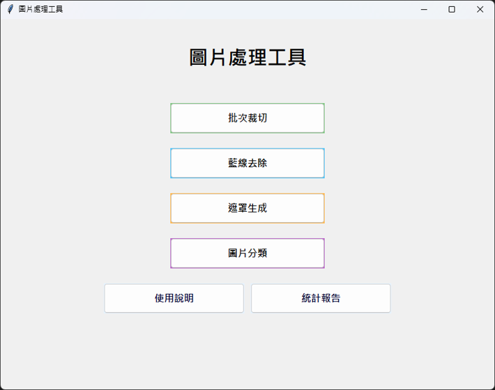
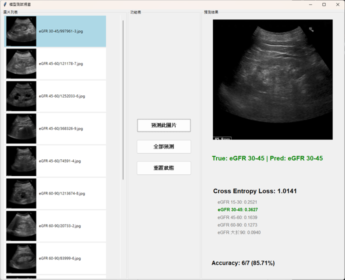

# 期末專題 – 腎臟超音波影像進行AI分割與慢性腎臟病期程分類

## 專案簡介
本專案為期末專題的程式碼部分，而資料集因為與義大醫院合作並通過IRB，因去識別且不公開原則所以無法放上來

- **影像處理與分析**：包括訓練資料集分類、遮罩生成、圖像裁切、圖像過濾雜訊、統計分析。
- **深度學習模型實作與測試**：包括 AlexNet、ResNet、EfficientNetB0、RepVGG、DeepLabV3 與 UNet 模型。
- **GUI 支援**：提供簡易圖形介面方便操作，包括一鍵訓練、監測指標、驗證結果。
- **實驗與測試**：每個模型均附有測試程式 `test_window.py` 用於快速驗證。

|  |  |
|:--:|:--:|
| 圖一、影像處理GUI | 圖二、深度學習訓練GUI |

|  |  |
|:--:|:--:|
| 圖三、分類模型測試GUI | 圖四、分割模型測試GUI |

---

## 資料夾與檔案說明(依字母順序)

### 1. `alexnet`
- **功能**：實作經典卷積神經網路 AlexNet。
- **主要檔案**：
  - `AlexNet.py`：AlexNet 模型定義。
  - `test_window.py`：測試程式。
  - `info.txt`：說明檔案。

### 2. `deeplabv3`
- **功能**：DeepLabV3 語意分割模型，支援 ResNet backbone。
- **主要檔案**：
  - `DeepLab_v3.py`：模型主程式。
  - `resnet.py`：ResNet backbone。
  - `test_window.py`：測試程式。
  - `info.txt`：說明檔案。

### 3. `efficientnetB0`
- **功能**：EfficientNetB0 模型實作與測試。
- **主要檔案**：
  - `EfficientNetB0.py`：模型定義。
  - `test_window.py`：測試程式。

### 4. `photo_process`
- **功能**：影像前處理與分析工具集合。
- **主要檔案**：
  - `auto_assort.py`：自動分類影像。
  - `auto_mask.py`：自動生成影像遮罩。
  - `batch_crop.py`：批量裁切影像。
  - `image_processor_gui.py`：GUI 操作程式。
  - `image_RB.py`：影像過濾。
  - `image_stats.py`：影像統計分析。
  - `k_fold.py`：交叉驗證工具。

### 5. `repVGG`
- **功能**：RepVGG 模型訓練與測試。
- **主要檔案**：
  - `RepVGG.py`：模型定義。
  - `RepVGG-A0-train.pth`：訓練好的權重檔。
  - `test_window.py`：測試程式。

### 6. `resnet`
- **功能**：ResNet 模型實作與測試。
- **主要檔案**：
  - `Resnet.py`：模型定義。
  - `test_window.py`：測試程式。

### 7. `unet`
- **功能**：UNet 語意分割模型。
- **主要檔案**：
  - `UNet.py`：模型定義。
  - `test_window.py`：測試程式。

## 執行方式

### 可分為CNN模型與圖片處理兩種

一、圖片處理
1. cd好位置後執行GUI介面
```bash
python image_processor_gui.py
```
3. 根據目的點選相關按鈕操作
4. 點選後會跳出視窗供選擇資料夾並處理後輸出到固定目的地

二、CNN模型使用
1. 進入想要測試或訓練的模型資料夾
2. 下載好必要的函式庫後執行
```bash
python __init__.py
```
3. 根據目的點選相關按鈕操作
4. 測試按鈕點選後會跳出測試視窗供使用


## 專案特色

- 集合多種深度學習模型於一個專案中，便於比較與學習。
- 具備良好GUI與終端提示，對使用者友善與簡單上手。
- 提供完整影像前處理工具，支援多種任務。
- 每個模型附有簡易測試程式，方便快速驗證與展示。
- 結構清楚，方便後續擴充其他模型或實驗。